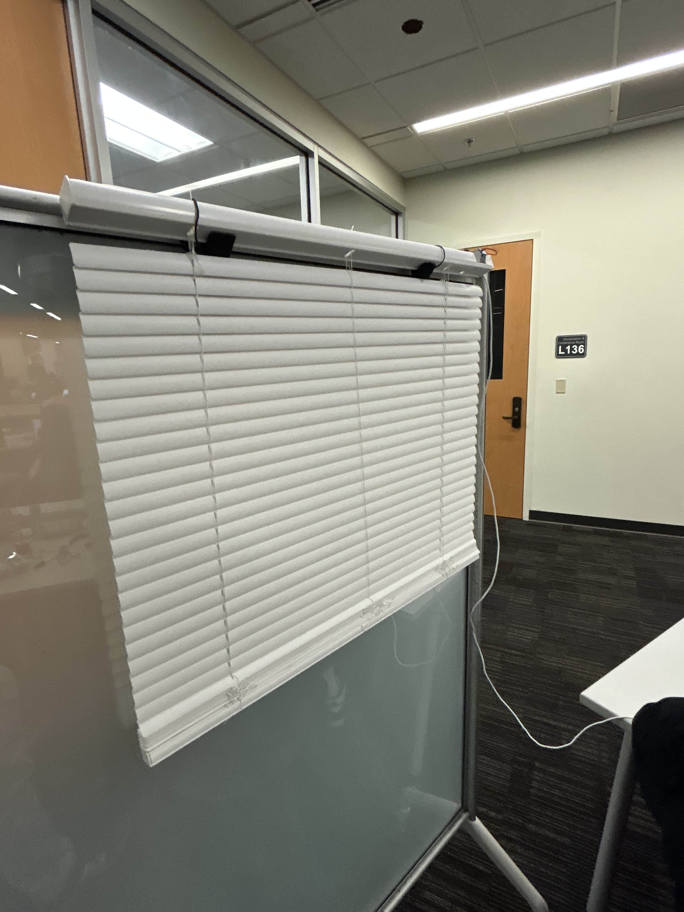

# IoT Blinds

## Overview

**IoT Blinds** was a semester-long group project for a full-stack *Internet of Things* course. The goal of the project was to build a system that allows users to control real, physical window blinds through a web application.

The system consists of a full-stack web app that connects to stepper motors mounted on standard household blinds. Users can control how open or closed multiple sets of blinds are, as well as enable an **automatic mode** that adjusts the blinds based on the ambient light level in the room.

## Features

- Manual control of multiple sets of blinds  
- Automatic mode based on ambient light  
- Real-time communication between hardware and web app  
- Cloud-hosted backend with no self-hosted servers  

## Hardware

- **Stepper motors** mounted on blinds  
- **ESP32 microcontrollers** for motor control and internet connectivity  

The ESP32 devices handle communication with the cloud and execute motor commands received from the web application.

## Tech Stack

### Frontend
- JavaScript

### Backend
- JavaScript  
- Firebase (NoSQL database)

### Architecture
- Serverless **JAM stack** architecture  
- No dedicated servers hosted by us  
- Backend logic and hosting handled by third-party cloud services  

We chose this approach because the primary focus of the project was **hardware integration**, and Firebase provided an easy way to manage real-time data without maintaining our own infrastructure.

## Notes

All application logic is cloud-hosted, meaning no programs need to be run locally for the system to function. The web app communicates directly with Firebase, and the ESP32 devices listen for updates in real time.
